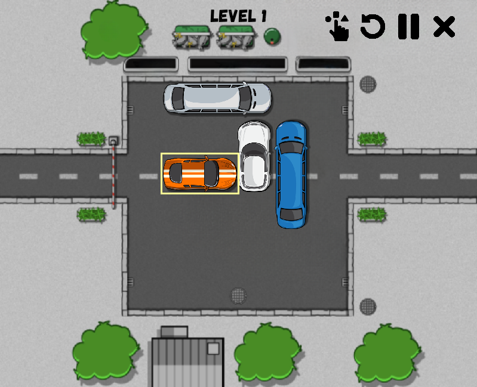

# Rush Hour application


## Overview

An application developed in Python for solving the Rush Hour game by using the BFS, DLS, UCS, A* Search algorithms.

## Prerequisites

*   Python 3.13+
*   `pygame` library


## Setup & Installation

1. **Clone the repository:**

```bash
git clone https://github.com/KhaiPhong25/RushHour.git
cd RushHour
```

2. **Install dependencies:**

```bash
pip install pygame
```

## How to run the application

### Method 1 (if you are using VS Code):
Run the main.py file via the Python extension in VS Code. 

### Method 2 (using the Terminal):
Run the `main.py` file by using the `python main.py` command in the Terminal.

## Video Demo
https://www.youtube.com/watch?v=EcsvPW-YJ7Q